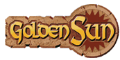
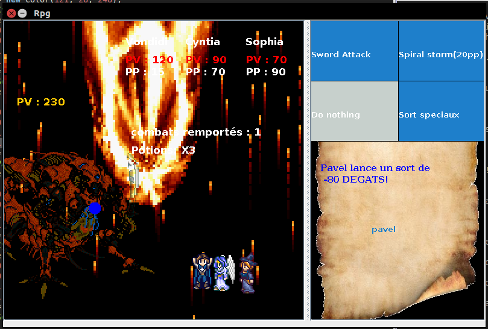
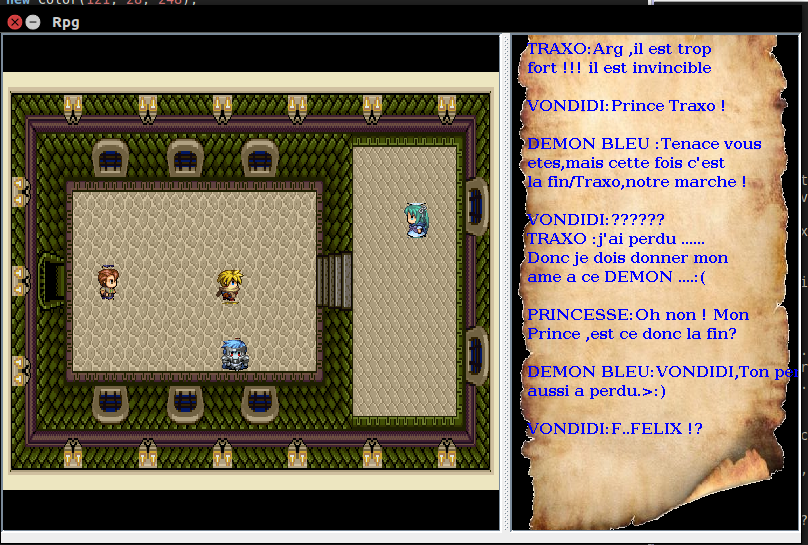

#Next Generation 
jeu Golden Sun . 
 

#Pour lancer le programme
il faut 
sous Windows : 
-Aller dans GoldenSun/src/ et cliquer sur le fichier GameNoSouned.jar 
sous Linux ou autres :  
des .exe sont disponibles pour windows. 
-java -jar Programme.jar  ou  executer le fichier binaire Fenetre.class ou encore ./Prorgamme.jar  
 
 
#Histoire 
Didi et ses amis(sophia(nini) ,mage et Cynthia fée )sont convoqués au palais par le roi seulement ,arrivé au palais  
nous voyons un demon bleu ,il faudra alors passer bien des epreuves pour le retrouver car il a kidnape la princesse... 
D'une dimension a une autre,les combats seront multiples. 

 
#Mode de jeu
Il y a deux modes de jeu le combat : 

  
et le mode histoire (courant) : 

 
on joue avec les fleches de directions ,et ENTER est la touche valider.
#Boutons 
Le bouton "a" accelére le texte ,et "b" le ralantis  
#le bouton "p" donne une potion a toute l'equipe (on en a 3)

#soluce
+ Dekens se trouve en haut a droite de la maison la plus a gauche dans l'autre dimension 
+ Les gardiens de la zone 51(ou autre dimension) sont dans un premier temps 
LINK de The Legend of Zelda 
Puis ERZA (Titania) de Fairy tail. 
+ Dans une des maisons on trouve un pingouin Jaune qui regenere de 10 pv.
+ Dans le donjon juste avant la fin se trouve cache le pokemon <em>Mewto</em>

#attaques
De nombreuses attaques sont disponibles : 
<em>Didi(FILS DE FELIX) et CYNTHIA</em>
+ attaque simple :  
+ sort de la spirale(Vondidi) ou diffraction(CYNTHIA) 
+ 2 sort speciaux extremement puissant pour chaque personnages 
 

+ sophia A UN SORT(Neige Rose) qui fais  
+ 10 PV pour toute l'equipe et <em>2 sort speciaux tres puissant.</em> 

 
Le jeu est tres difficile(on ne sais pas les points de degats et a part le roi du jeu personne ne l'a gagne.) 

 
#Credit 
GoldenSun est Jeu édité par Nintendo ,devellopé par Camelot Software Planning 
les Concepteurs sont :	Yasuhiro Taguchi (directeur) 
Hiroyuki Takahashi) 
Hiroshi Yamauchi (producteur) 
Shin Yamanouchi (character designer) 
Hiroshi Kajiyama (monster designer) 
Musique	Motoi Sakuraba 
Et Bien d'autres , Les musiques proviennent du Jeu GoldenSun Age Perdu 

